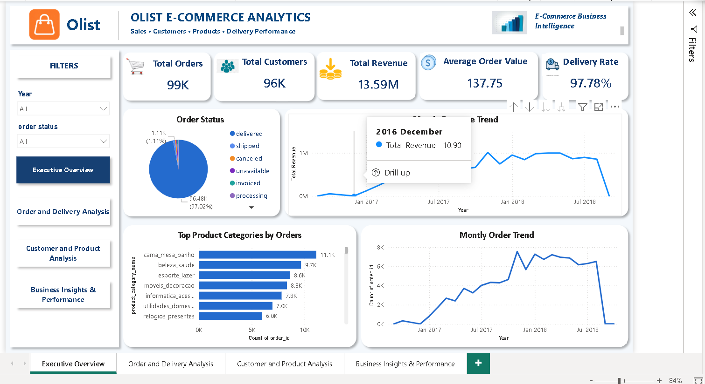
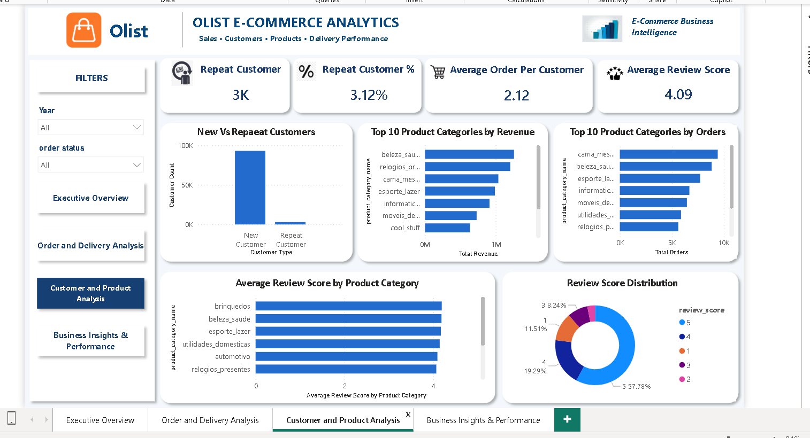
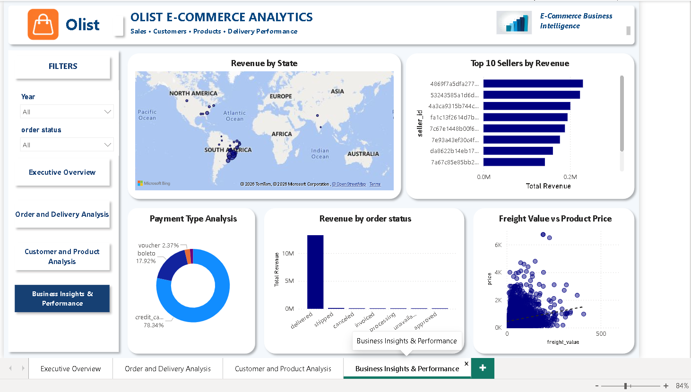

# Olist E-Commerce Data Analysis

## 📊 Project Overview

This project analyzes e-commerce performance using the **Olist Brazilian E-Commerce dataset** and an interactive **Power BI dashboard**.

The analysis focuses on key business metrics such as orders, revenue, average order value, order status, and monthly performance to understand overall sales trends and business performance.

The goal of this project is to transform raw e-commerce data into meaningful business insights that can support data-driven decision-making.

---

## 🎯 Business Objectives

The project aims to answer questions such as:

* How are orders and revenue changing over time?
* What is the overall order volume and revenue performance?
* What is the average order value?
* What is the distribution of order statuses?
* Which periods generate higher order and revenue volumes?
* What patterns can be identified from the e-commerce data?

---

## 🗂️ Dataset

The project uses the **Olist Brazilian E-Commerce Public Dataset**, which contains information related to orders placed through the Olist marketplace.

The dataset includes information such as:

* Orders
* Order items
* Customers
* Products
* Sellers
* Payments
* Reviews
* Geolocation

The data was prepared and modeled in Power BI for analysis and visualization.

---

## 🛠️ Tools & Technologies

* **Power BI**
* **DAX**
* **Power Query**
* **Data Modeling**
* **Microsoft Excel / CSV**
* **GitHub**

---

## 📌 Key Performance Indicators

The dashboard includes key metrics such as:

* **Total Orders**
* **Total Revenue**
* **Average Order Value (AOV)**
* **Order Status**

Additional metrics and analysis are presented through interactive visualizations.

---

## 📈 Dashboard

The Power BI dashboard provides an interactive view of e-commerce performance, including:

* Monthly Order Trends
* Monthly Revenue Trends
* Orders by Status
* Revenue Analysis
* E-commerce performance metrics
* Interactive filtering

## 📈 Dashboard

The Power BI dashboard provides an interactive view of e-commerce performance across four analytical areas:

### 1. Executive Overview

### 2. Order and Delivery Analysis

### 3. Customer and Product Analysis

### 4. Business Insights & Performance

---

## 💡 Key Insights

The dashboard is designed to identify:

* Trends in order volume over time
* Revenue patterns across different periods
* Differences between order statuses
* Overall sales performance
* Relationships between product and order-related metrics

Specific findings are based on the final Power BI analysis.

---

## 🔍 Analysis Process

The project followed these main steps:

### 1. Data Preparation

Data was cleaned and transformed using Power Query.

### 2. Data Modeling

Relevant Olist tables were connected to create a structured data model.

### 3. DAX Analysis

Measures were created to calculate important business metrics such as orders, revenue, and AOV.

### 4. Dashboard Development

Interactive Power BI visuals were created to communicate trends and business performance.

### 5. Business Analysis

The dashboard was reviewed to identify meaningful patterns and insights from the data.

---

## 📁 Project Files

| File                       | Description                       |
| -------------------------- | --------------------------------- |
| `OlistDatasetProject.pbix` | Power BI dashboard and data model |
| `Dashboard/`               | Dashboard screenshots             |

---

## 🚀 Skills Demonstrated

This project demonstrates practical experience with:

* Data cleaning
* Data transformation
* Data modeling
* DAX
* KPI development
* Data visualization
* Dashboard design
* Business analysis
* Communicating insights through data

---

## 📬 Project Purpose

This project was created as part of my **Data Analyst portfolio** to demonstrate my ability to work with real-world e-commerce data and transform it into an interactive business intelligence solution.
